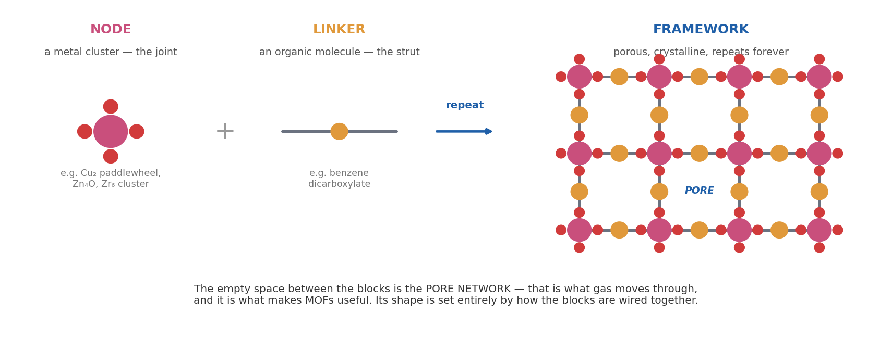

# Chapter 1 — Background: What a MOF Is, and Why Anyone Cares

*Assumes nothing. If you know what a MOF is, skip to Chapter 2.*

---

## 1.1 · Start with a sponge

Imagine a sponge, but built at the scale of individual molecules, and perfectly regular —
every hole exactly the same size, arranged in a perfect repeating pattern.

That is a **metal–organic framework**, or **MOF**.

It is made of exactly two ingredients, joined together over and over in three dimensions:

- A **node** — a small cluster of metal atoms, usually held together by oxygen. Rigid, and
  it points in fixed directions. This is the **joint** of the structure.
  *(Chemists also call these **secondary building units**, or **SBUs**.)*
- A **linker** — an organic molecule, typically a rigid ring with grabbing groups on each
  end. This is the **strut**.

Join joints to struts, repeat forever, and you get a framework with large regular holes
running through it.

---

## 1.2 · Why the holes matter

The holes are the entire point.

Because a MOF is mostly empty space with an enormous amount of internal surface, it can hold
a lot of gas. To put a number on it: **MOFs routinely have internal surface areas above
3,000 m² per gram**. A single gram of powder has roughly the surface area of a football
pitch.

That makes them candidates for:

| Application | Why a MOF helps |
|---|---|
| **Gas storage** | Store hydrogen or methane at lower pressure than an empty tank would need |
| **Carbon capture** | Selectively grab CO₂ out of a flue-gas mixture |
| **Gas separation** | Separate xenon from krypton, or oxygen from nitrogen, by letting one through and not the other |
| **Catalysis** | Exposed metal sites inside the pores act as reaction sites |

**The key point for us:** every one of those behaviours depends on the *shape and
connectivity of the pore network*. And the pore network is just the empty space left over by
how the blocks are wired together.

> **Remember this sentence, it is the whole project:**
> *The wiring determines the pores, and the pores determine the behaviour.*

---

## 1.3 · Why there are so many of them

Here is what makes MOFs unusual as materials.

Because both ingredients are rigid and bind in predictable directions, **you can design them
like Lego**. Pick a node with four connection points and a linker of a certain length, and
you can predict the framework you will get before you make it. Swap in a longer linker and
you get the same architecture with bigger pores.

This design principle has a name: **reticular chemistry**.

The consequence is combinatorial. A few hundred known node types × a few thousand possible
linkers = **an astronomically large design space**. Tens of thousands of MOFs have been
synthesised. **Hundreds of thousands** more have been generated computationally as
candidates.

That abundance is the opportunity — and, as Chapter 2 explains, it is also the problem.

---

## 1.4 · The four structures you will see constantly

Throughout the project we use four MOFs as test cases. They are standard benchmarks: their
structures are published and independently verified, so we can check our software against a
known answer instead of against itself.

Here is what our own pipeline measures for each — **these are our computed numbers**, and they
match the published values:

| Structure | Metal | Atoms in cell | Bonds found | Blocks | Node c.n. | Net | Why it is in the set |
|---|---|---|---|---|---|---|---|
| **HKUST-1** | Cu | 156 | 198 | 14 (6 nodes, 8 linkers) | **4** | `tbo` | The classic copper *paddlewheel*; the most-cited MOF node |
| **MOF-5** | Zn | 424 | 512 | 32 (8 nodes, 24 linkers) | **6** | `pcu` | The first famous MOF; simple cubic, easy to sanity-check |
| **ZIF-8** | Zn | 276 | 312 | 36 (12 nodes, 24 linkers) | **4** | `sod` | **Our control** — binds through nitrogen, contains no oxygen at all |
| **UiO-66** | Zr | 114 | 184 | 7 (1 node, 6 linkers) | **12** | `fcu` | **The hard case** — 12-connected, and it breaks naive software |

Two of these deserve a note now, because they come back repeatedly.

**ZIF-8 is our control.** Almost every MOF binds its metal through *oxygen* (in a group
called a carboxylate). ZIF-8 does not — it binds through *nitrogen*, and contains no oxygen
whatsoever. So any method that quietly assumes "metals bond to oxygen" will behave
differently on ZIF-8, and that difference is a signal something is wrong.

**UiO-66 is the stress test.** Its zirconium cluster connects to **twelve** linkers. Its unit
cell contains exactly **one** such cluster, which means almost all twelve of those
connections leave the cell and come back from a neighbouring copy. Software that does not
handle that correctly gets the answer badly wrong — as Chapter 5 shows with measured numbers.

---

## 1.5 · Terms introduced in this chapter

| Term | Meaning |
|---|---|
| **MOF** | Metal–organic framework — a porous crystal of metal clusters joined by organic molecules |
| **node** (or **SBU**) | The metal cluster; the joint |
| **linker** | The organic molecule; the strut |
| **pore network** | The connected empty space inside the framework; what gas moves through |
| **reticular chemistry** | Designing frameworks by choosing node and linker geometry |
| **coordination number (c.n.)** | How many linkers a node connects to |
| **net** | The abstract repeating pattern the framework follows (e.g. `tbo`, `pcu`, `sod`, `fcu`) |
| **carboxylate** | `–COO⁻`, the most common group by which a linker grabs a metal |

---

**Next:** [Chapter 2 — The Problem Statement](02_problem.md), which explains what we are
actually trying to solve and why it needs computer science rather than more chemistry.
