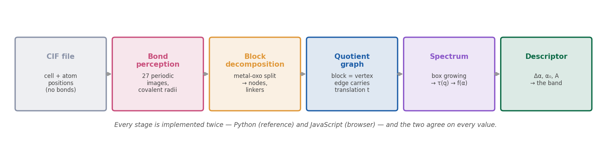

# Chapter 2 — The Problem Statement

*The most important chapter. If you understand this, you can defend the project.*

---

## 2.1 · The situation

From Chapter 1:

- There are **hundreds of thousands** of MOFs — synthesised and computationally generated.
- Which ones are useful depends on their **pore network**.
- We would like to find the good ones.

So: how do you find out what a given MOF does?

---

## 2.2 · The standard answer, and why it does not scale

The rigorous method is **molecular simulation** — typically **GCMC** (Grand Canonical Monte
Carlo). You simulate gas molecules moving into the pores, and measure how much is taken up.

It works. It is accurate. And it takes **hours per structure**.

Now do the arithmetic:

```
        1 structure  ≈  several hours of computation
   100,000 structures ≈  decades of continuous computation
```

You cannot screen the design space this way. Even with a large cluster, exhaustively
simulating every candidate is not a realistic plan. **The bottleneck is not chemistry. It is
computational cost.**

---

## 2.3 · The question this project asks

> **Can a purely structural descriptor — computed from a framework's connectivity alone, in
> seconds — group MOFs into meaningful families, so that a new candidate can be triaged
> without running any expensive calculation?**

Read that carefully, because the framing matters enormously when someone challenges it.

**We are not claiming to replace simulation.** A cheap structural number will never tell you
the adsorption isotherm. What it might do is tell you *which few hundred* of a hundred
thousand candidates are worth the expensive calculation.

> **The value proposition in one line:**
> Not a replacement for simulation — **a filter that decides what to simulate.**

If a descriptor takes 100,000 candidates down to 200 worth simulating properly, that is the
contribution. It does not need to be a predictor to be useful; it needs to be a *usefully
selective filter*.

---

## 2.4 · Why connectivity, and not something else?

This is the step that needs justifying, and it is a chain of five links.

**1 — A MOF is not a molecule, it is a repeating framework.**
What makes one MOF different from another is not only *which atoms* it contains, but **how
those atoms are wired together**. Two frameworks made from identical components can behave
completely differently if the connectivity differs.

**2 — Wiring is exactly what a graph describes.**
Collapse each building block to a point, and each bond between blocks to a line. The
chemistry is deliberately thrown away; what remains is pure connectivity.

**3 — The useful properties follow the wiring.**
Gas moves through the pore network. The pore network *is* the empty space left behind by that
wiring. So a description of the connectivity is a description of the pore system — which is
what determines behaviour.

**4 — Networks can be measured.**
Once the framework is a graph, an entire established field applies: coordination number,
centrality, the Laplacian, fractal and multifractal measures. None of this needs to be
invented.

**5 — A spectrum compresses a whole framework into a few numbers.**
Which is what makes comparison at scale possible: two MOFs, or ten thousand, without
simulating any of them.

---

## 2.5 · What we deliberately give up

Be honest about this, because a chemist will ask.

**The graph is unweighted.** It does not know which element an atom is. It does not know
polarisability, charge, or binding energy. A copper node and a zinc node are the same dot.

That is a real limitation and we state it wherever we quote results.

**It is also the point.** Whatever survives that stripping is **pure architecture** — and
architecture transfers across chemistries in a way an element-specific descriptor cannot. If
a structural result holds for a copper framework and a zinc framework alike, it is telling
you something genuinely about the *shape* of the material.

---

## 2.6 · Where the project came from

The immediate brief we were given was narrower:

> *"Highlight the influential nodes, find the spectrum, and deduce something like — all
> zirconium MOFs fall under this spectrum."*

Three tasks. Each one turned out to have a specific obstacle in front of it, and dealing with
those obstacles is most of what the project became:

| The brief | The obstacle | Where it is resolved |
|---|---|---|
| Highlight the influential nodes | In a perfect crystal, every node is symmetry-equivalent — influence cannot be ranked | [Ch. 5](05_graphs.md), [Ch. 8](08_results.md) |
| Find the spectrum | Our implementation had a defect that deleted the peak of every spectrum | [Ch. 9](09_mistakes.md) |
| Deduce a family band | The band exists, but it is confounded by graph size | [Ch. 8](08_results.md), [Ch. 10](10_limitations.md) |

---

## 2.7 · The full pipeline, in one picture



Six stages. Chapters 3 to 6 explain each one in turn.

| Stage | What goes in | What comes out | Chapter |
|---|---|---|---|
| CIF file | — | unit cell + atom positions (**no bonds**) | [3](03_crystallography.md) |
| Bond perception | positions | a bond list, inferred from distance | [3](03_crystallography.md) |
| Decomposition | atoms + bonds | building blocks (nodes, linkers) | [4](04_decomposition.md) |
| Graph construction | blocks | a labelled quotient graph | [5](05_graphs.md) |
| Spectrum | graph | τ(q), α, f(α) | [6](06_multifractal.md) |
| Descriptor | spectrum | Δα, α₀, A → the band | [8](08_results.md) |

---

## 2.8 · How to answer the three questions you will definitely be asked

**"Why are you using network theory on a chemistry problem?"**
> Because MOF properties follow connectivity — gas moves through the pore network, and the
> pore network is the void the wiring leaves behind. Connectivity is exactly what a graph
> describes.

**"Why not just simulate them?"**
> Hours per structure, hundreds of thousands of structures. We are not replacing simulation;
> we are trying to decide which few hundred are worth simulating.

**"Isn't an unweighted graph throwing away the chemistry?"**
> Yes, deliberately — and we say so. It is also the point: what survives is pure
> architecture, which transfers across chemistries in a way an element-specific descriptor
> cannot.

---

**Next:** [Chapter 3 — Crystals and CIF Files](03_crystallography.md), which explains how a
crystal structure is stored and why every bond in this project had to be *guessed*.
