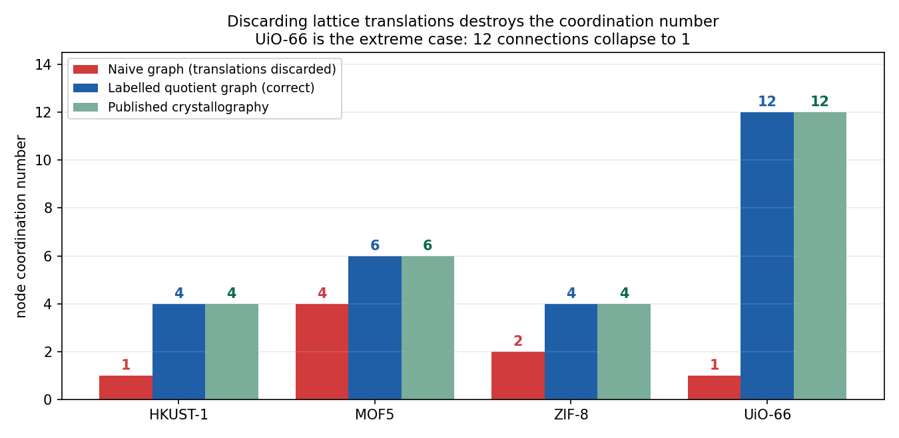
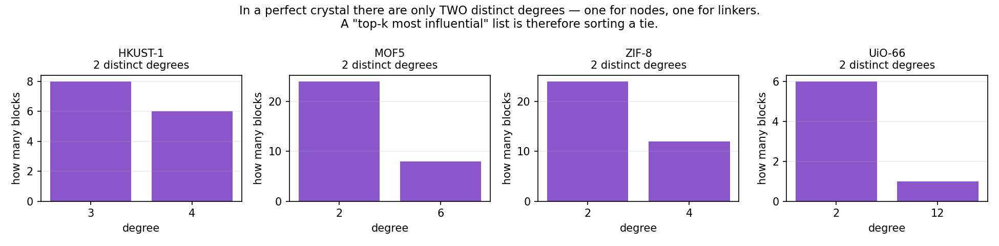
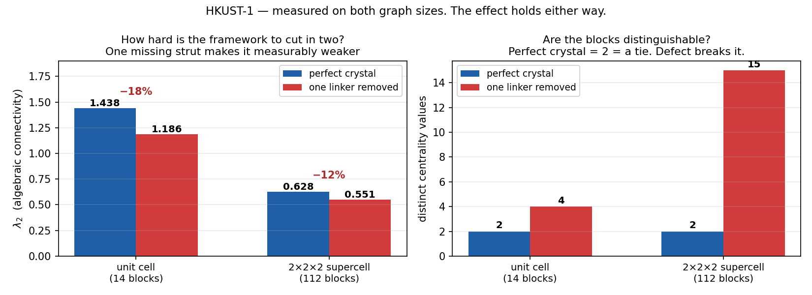

# Chapter 5 — Graph Theory, From Scratch

*Every term used in the rest of the project is defined here. Nothing is assumed.*

---

## 5.1 · What a graph is

A **graph** is the simplest possible description of "what is connected to what". Two
ingredients:

- a **vertex** (also called a **node**) — a thing. Drawn as a dot.
- an **edge** — a connection between two things. Drawn as a line.

That is all. A graph has no notion of distance, angle, size or chemistry. Two graphs are the
*same graph* if the same things are connected, however you choose to draw them.

> **Terminology warning.** In graph theory "node" means *vertex*. In MOF chemistry "node"
> means *the metal cluster*. Both appear in this project. Where it could be ambiguous, this
> textbook says **vertex** for the graph sense and **node** for the chemistry sense.

---

## 5.2 · Turning a MOF into a graph

Chapter 4 gave us building blocks. Now:

> **Each building block becomes one vertex.**
> **Each bond between two blocks becomes one edge.**

The atoms disappear. A copper paddlewheel of 14 atoms becomes a single dot. A benzene linker
becomes a single dot. What is left is the framework's **wiring diagram**.

Our four test structures, measured:

| Structure | Atoms | → Blocks (vertices) | of which nodes | of which linkers |
|---|---|---|---|---|
| HKUST-1 | 156 | **14** | 6 | 8 |
| MOF-5 | 424 | **32** | 8 | 24 |
| ZIF-8 | 276 | **36** | 12 | 24 |
| UiO-66 | 114 | **7** | 1 | 6 |

Note UiO-66: 114 atoms collapse to **7 vertices**, of which exactly **one** is the zirconium
cluster. Remember that — it is about to matter enormously.

---

## 5.3 · Degree — and why it *is* the coordination number

The **degree** of a vertex is simply **how many edges touch it**. Count the lines meeting a
dot.

Because every edge is a bond between blocks, the degree of a node vertex is *how many linkers
that metal cluster connects to* — which chemists already have a word for: the **coordination
number**.

> **degree (graph theory) = coordination number (chemistry)**

This is the bridge between the two halves of the project, and it is what makes the whole thing
checkable. **Coordination numbers are published.** If the literature says UiO-66's zirconium
cluster is 12-connected, then that vertex must have degree 12. If our graph says otherwise,
our graph is wrong.

That is a rare luxury: an independent ground truth to test against.

---

## 5.4 · The trap: a crystal has no edges

Here is the idea everything else depends on.

A crystal is **infinite**, but a CIF stores **one box**. Blocks near the wall of that box are
bonded to blocks in the *next box over*. Those bonds are real. There are two ways to handle
them:

**Naive:** draw one edge per pair of blocks that share a bond, and ignore which box the bond
crosses into.

**Correct:** keep one vertex per block, but **label every edge with the translation** saying
which copy of the box it reaches.

```
edge = ( block A , block B , translation t )

t = (0, 0, 0)    both blocks are in the same box
t = (1, 0, 0)    B is in the box one step along the first axis
t = (0, −1, 1)   B is one box back along axis 2, one forward along axis 3
```

A graph built this way is called a **labelled quotient graph**. The name is forbidding; the
idea is just *"a finite graph, plus a note on each edge saying which copy of the cell it
reaches"*. It is finite, so a computer can hold it — but it describes the infinite crystal
exactly.

### Why the labels cannot be dropped

Two blocks are often joined by **several** bonds running in **different** directions. Those are
genuinely different connections in the material. Without labels they all look like "A–B" and
collapse into a single edge, so the degree comes out too low.

---

## 5.5 · How bad it gets — measured

This is not a theoretical concern. Here are our actual measurements:



| Structure | Naive graph | Labelled quotient graph | Published |
|---|---|---|---|
| HKUST-1 | 1 | **4** | 4 ✓ |
| MOF-5 | 4 | **6** | 6 ✓ |
| ZIF-8 | 2 | **4** | 4 ✓ |
| **UiO-66** | **1** | **12** | 12 ✓ |

**UiO-66 is the extreme case.** Its unit cell contains exactly one zirconium cluster, and
nearly all twelve of its connections run out of the cell and back. Discard the translations
and the reported coordination number is **1** — the cluster appears to touch almost nothing.

It can fail worse still: if the linkers fold in on themselves too, the whole cell degenerates
into a **star** — one hub vertex joined to everything, every other vertex with degree 1. A star
is not a framework. Every centrality measure computed on it is meaningless, **and the failure
is silent** — no error, just plausible-looking numbers describing a material that does not
exist.

> **If you take one thing from this chapter:** the labelled quotient graph is not
> sophistication for its own sake. Without it, the numbers are simply wrong.

---

## 5.6 · Supercells

A single unit cell can be too small to measure anything on. UiO-66's cell graph has just 7
vertices and a **diameter** of about 2 — there is essentially no range of distances to fit
anything across.

So we build a **supercell**: stack n×n×n copies of the cell and join them up.

Because every edge already carries its translation, this expansion is **exact and cheap** —
place a copy of each block in every cell of the supercell, and join (block *i*, cell *c*) to
(block *j*, cell *c + t*) with wraparound.

```python
# code_10_multifractal_spectrum.py — supercell_graph()
for cell in cells:                      # every cell in the n×n×n block
    for (i, j, t) in edges:             # every edge of the quotient graph
        target = tuple((cell[k] + t[k]) % n for k in range(3))
        G.add_edge(idx[(i, cell)], idx[(j, target)])
```

HKUST-1: 14 vertices in the unit cell → **112** in a 2×2×2 supercell.

**Remember this**, because it becomes the central problem of Chapter 8: *how big we make the
supercell is a choice we make, not a property of the material.*

---

## 5.7 · Centrality — "which blocks matter most?"

Three standard measures:

| Measure | The question it answers | In a MOF |
|---|---|---|
| **Degree** | How many neighbours does this vertex have? | The coordination number |
| **Eigenvector centrality** | Is this vertex connected to *other well-connected* vertices? | Whether a block sits in a densely tied region |
| **Betweenness** | How many shortest routes across the network pass *through* this vertex? | Whether a block is a bottleneck the framework depends on |

Eigenvector centrality is "importance by association" — you are important if your neighbours
are important. It is computed by power iteration on the adjacency matrix. Betweenness uses
**Brandes' algorithm** [17].

---

## 5.8 · The finding: influence cannot be ranked in a perfect crystal

The brief asked us to find the most influential nodes. Here is what we actually measured:



> **Every one of the four structures has exactly TWO distinct degree values.**
> One for all the nodes, one for all the linkers. Nothing else.

This is not a defect in the calculation — **it is what a perfect crystal is.** Every metal
cluster in HKUST-1 is related to every other by a symmetry operation, so they are genuinely,
exactly identical. There is no "most influential" cluster because they cannot be told apart.

> **A "top-12 most influential" list from such a graph is not a ranking. It is the first
> twelve entries of a tie, and its contents depend entirely on the order the blocks happened
> to be indexed in.**

This is a real and citable finding rather than a failure. It says the question is *ill-posed*
for a defect-free framework, and it explains why an influence ranking computed on one is
unstable.

**A diagnostic worth knowing:** if a block graph has one vertex of very high degree and
essentially every other at degree 1, that is not a MOF — that is the star-shaped signature of
a broken (non-periodic) construction. Check the graph before interpreting the result.

---

## 5.9 · The Laplacian and λ₂

The **Laplacian** is a matrix built from the graph:

```
L = D − A
```

where `D` is the diagonal matrix of degrees and `A` is the adjacency matrix (which vertices
are joined). You never need to look at the matrix itself — what matters is its
**eigenvalues**, a list of numbers extracted from it.

- **The smallest is always 0.** How many zeros there are tells you **how many disconnected
  pieces** the graph has. Two zeros means the framework has fallen apart — a useful automatic
  alarm.
- **The second-smallest, λ₂**, is the **algebraic connectivity** [16]. It measures **how hard
  the network is to cut in two**. Higher = more robustly tied together. Lower = there is a weak
  place.
- The largest eigenvalue is bounded by twice the maximum degree — a cheap sanity check.

> **λ₂ in one sentence:** a single number for how well-knit the framework is.

---

## 5.10 · Defects: deliberately breaking the crystal

Section 5.8 left us stuck — influence cannot be ranked. The way out is to **break the
symmetry**, and it turns out to be better chemistry rather than a workaround.

A **defect** is a place where a real crystal departs from its ideal repeating pattern. The kind
we use is a **missing linker**: a strut that should occupy some position simply is not there.

> **This is not hypothetical.** Missing-linker defects are real, common, and *deliberately
> engineered*. **UiO-66 is famous for tolerating large numbers of them** [15] — chemists create
> them on purpose, because removing linkers widens the pores and exposes metal sites, changing
> how the material adsorbs and catalyses. A defective MOF is often the *useful* one.

In the graph, introducing a defect is just **deleting one linker vertex** and its edges.

### What we measure when we do it



| Graph | λ₂ perfect | λ₂ with one linker gone | Drop | Distinct centrality values |
|---|---|---|---|---|
| **Unit cell** (14 blocks) | 1.438 | 1.186 | **−18%** | **2 → 4** |
| 2×2×2 supercell (112 blocks) | 0.628 | 0.551 | −12% | 2 → 15 |

Both graphs show the same effect. The unit-cell numbers (1.44 → 1.19) are the ones quoted
elsewhere in the project.

Two things happen, and both are meaningful:

1. **The blocks become distinguishable.** Distinct centrality values go from 2 to 4 — "most
   influential" becomes a question with an answer.
2. **λ₂ falls by 18%.** The framework is measurably easier to cut in two. **That number is
   the weakening, quantified**, from removing a single strut.

> **The wider point:** this turns a dead end into a method. *"Which block matters most?"* has
> no answer in a perfect crystal — but *"how much does the framework suffer when this
> particular block is removed?"* always does. And since real MOFs are defective anyway, it is
> also the more physically honest question.

---

## 5.11 · Terms introduced in this chapter

| Term | Meaning |
|---|---|
| **vertex** | One building block, drawn as a dot |
| **edge** | A bond between two blocks, drawn as a line |
| **degree** | How many edges touch a vertex — **the coordination number** |
| **labelled quotient graph** | Finite graph whose edges carry translations; describes the infinite crystal exactly |
| **supercell** | n×n×n copies of the unit cell, stacked, to give a bigger graph |
| **diameter** | The largest number of steps between any two vertices |
| **centrality** | Any measure of how structurally important a vertex is |
| **eigenvector centrality** | Importance by association with important neighbours |
| **betweenness** | How many shortest paths pass through a vertex |
| **Laplacian** `L = D − A` | Matrix whose eigenvalues describe connectivity |
| **λ₂ (algebraic connectivity)** | How hard the network is to cut in two |
| **defect** | A missing linker — real MOF chemistry, modelled by deleting a vertex |

---

**Next:** [Chapter 6 — The Multifractal Spectrum](06_multifractal.md), the descriptor itself.
