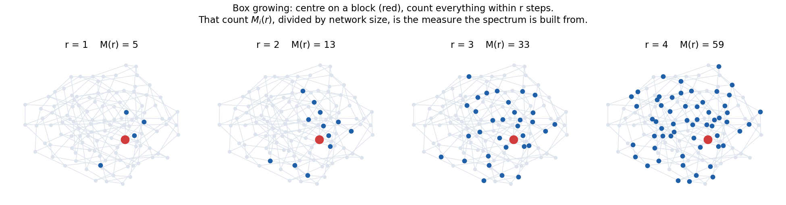

# Chapter 6 — The Multifractal Spectrum

*The descriptor itself. Built from scratch, no prior maths assumed.*

---

## 6.1 · Start with a simpler question

Forget spectra for a moment. Ask something concrete:

> **How much network is near a given block?**

Pick a block. Draw a ball of radius *r* around it — meaning "everything within *r* steps
through the graph" — and count what falls inside. Call that count **M(r)**.



*(Real HKUST-1 graph, 112 vertices. Red = the chosen block. Blue = everything within r steps.)*

Do that for a range of radii and you get a **growth curve** for that block: how fast the
network opens out around it.

This is called **box growing**, and it is the measure the whole descriptor is built from.

---

## 6.2 · Why one number is not enough

If a framework were perfectly uniform, every block would grow at the same rate, and a
**single number** — an ordinary fractal dimension — would describe the whole thing.

Real frameworks are not uniform. Some regions are tightly tied together; others open out into
large voids. Different blocks grow at different rates.

So instead of one number you need a **distribution** of growth rates. That distribution is the
**multifractal spectrum**.

> "Multi-fractal" simply means *many* local dimensions rather than one. Nothing more exotic
> than that.

---

## 6.3 · The four steps

The method is from **Xiao, Wang & Li (2021)**, reference [2]. Four steps.

### Step 1 — the measure

For each **influential** block *i* (the top 10% by degree, per the paper's iNMFA variant) and
each box radius *r*, take the count `M_i(r)` and normalise by the network size `N`:

$$p_i(r) = \frac{M_i(r)}{N}$$

This makes it a probability: "what fraction of the network is within *r* of block *i*".

### Step 2 — the partition function

Sum those measures, each raised to a power *q*:

$$\mathcal{P}_q(r) = \sum_{i \in I} p_i(r)^{\,q}$$

**What *q* does — this is the key idea.** Think of *q* as a zoom control:

| *q* | What the sum emphasises |
|---|---|
| large positive | blocks with the **most** network around them — the dense regions |
| *q* = 0 | everything equally (every term becomes 1) |
| large negative | blocks with the **least** network around them — the sparse regions |

Sweeping *q* from −10 to +10 therefore probes different parts of the framework in turn.

### Step 3 — the mass exponent

`𝒫_q(r)` grows as a power of the radius. The exponent is **τ(q)**:

$$\mathcal{P}_q(r) \sim \left(\frac{r}{r_N}\right)^{\tau(q)} \qquad\Longrightarrow\qquad
\boxed{\ \tau(q) = \frac{\ln \mathcal{P}_q(r)}{\ln (r/r_N)}\ }$$

where `r_N` is the network's diameter (used to make the radius dimensionless).

> ⚠ **This boxed definition is exactly where our worst bug lived.** Note that it is a
> **ratio** — which, fitted over several radii, is a straight line **through the origin**. It
> is *not* an ordinary least-squares slope. [Chapter 9](09_mistakes.md) shows what happened
> when we got that wrong.

### Step 4 — the Legendre transform

Finally, convert τ(q) into the spectrum:

$$\alpha(q) = \frac{d\tau}{dq} \qquad\qquad f(\alpha) = q\,\alpha(q) - \tau(q)$$

Plot `f(α)` against `α` and you have the multifractal spectrum.

---

## 6.4 · Reading the spectrum

This is the part to actually understand — the equations are machinery, this is meaning.

| Quantity | Formally | **What it means physically** |
|---|---|---|
| **α** | `dτ/dq` | How fast the network grows around **one particular block** — a *local* dimension |
| **f(α)** | `qα − τ` | **How much of the framework** shares that growth rate |
| **α₀** | the α where f(α) peaks | The **typical** growth rate — the framework's dominant dimension |
| **Δα** | `α_max − α_min` | **How varied the framework is.** Narrow = uniform throughout. Wide = a mix of tight and open regions |
| **A** | `ln[(α₀−α_min)/(α_max−α₀)]` | **Asymmetry** — whether the framework is mostly dense with a few voids, or mostly open with a few dense knots |

> **The one-sentence summary:**
> A spectrum is a **fingerprint of pore-network heterogeneity**, expressed as a curve.
> **Δα** is that fingerprint reduced to a single number — which is what makes a *band*
> possible at all.

---

## 6.5 · The shape is not optional

This is important enough to be its own section, because we used it as a test and it caught a
real bug.

> **A multifractal spectrum must be an INVERTED PARABOLA whose peak sits at q = 0, where
> f(α₀) = D₀, the fractal dimension.**

That is a mathematical property, not a stylistic preference. Why:

- At `q = 0`, the Legendre transform gives `f = 0·α − τ(0) = −τ(0)`.
- `−τ(0)` is `D₀`, the box dimension — a positive number, and the **maximum** of the curve.
- Away from `q = 0` in either direction, `f(α)` falls off.

∴ peak in the middle, falling on both sides → **∩ shape**.

**If your computed spectrum does not have this shape, your implementation is wrong.** Not your
material — your code. This is a free correctness test, and every project using this method
should run it.

We did. It failed. See [Chapter 9](09_mistakes.md).

---

## 6.6 · Box growing versus box covering

There are two ways to build the measure, and the difference matters:

| Method | How the measure is obtained | Random? |
|---|---|---|
| **Box growing** | Centre a ball on block *i*, grow *r*, count what is inside → `M_i(r)` | **No — deterministic** |
| **Box covering** | Tile the whole network with randomly-seeded boxes; a block's measure is the size of whichever box happens to cover it | **Yes — needs many trials** |

The paper [2] specifies **box growing**. Because it is deterministic, repeated runs are
bit-identical and there is no reproducibility problem at all.

Box covering [3] is the older, more general family. We implement both — box covering in
`code_10`, box growing in `code_11` — and use the agreement between them as a check.

> **Note for anyone reading the code:** box covering being random is the source of a *second*
> bug we found, described in Chapter 9. If you are averaging over random trials, the order in
> which you average and exponentiate is not free.

---

## 6.7 · Complexity and the parameters that control it

Worth knowing, because a CSE examiner will ask.

| Step | Cost |
|---|---|
| Bond perception | O(N²) over 27 periodic images |
| All-pairs shortest paths | O(N²) memory for the distance matrix |
| Box growing | O(N²) once distances exist |

The `O(N²)` memory is why the analysis is capped:

```python
MIN_CELL_LENGTH  = 48.0   # Å — supercell must reach this in every direction
MAX_ATOMS        = 7000   # the all-pairs distance matrix is O(N²) in memory
INFLUENTIAL_FRAC = 0.10   # top 10% of blocks, per the paper's iNMFA definition
Q_VALUES         = linspace(-10, 10, 41)
WINDOW_FRAC      = 0.34   # fit τ(q) over r ≤ 0.34 × diameter
```

**Why the fit window?** Once *r* approaches the graph diameter, a single box covers
everything and `ln 𝒫_q` flattens out — it stops being a power law. Fitting only over
`r ≤ 0.34 × diameter` keeps the fit inside the genuinely scaling region.

> ⚠ **`MIN_CELL_LENGTH` and `MAX_ATOMS` between them decide how big the graph is.** Hold that
> thought — Chapter 8 shows they end up driving the result more than the chemistry does.

---

## 6.8 · Terms introduced in this chapter

| Term | Meaning |
|---|---|
| **box growing** | Centre a ball on a block, grow *r*, count what is inside |
| **box covering** | Tile the network with random boxes; stochastic alternative |
| **M_i(r)** | Number of vertices within *r* steps of block *i* |
| **p_i(r)** | `M_i(r)/N` — the normalised measure |
| **q** | Distortion exponent; a zoom control between dense and sparse regions |
| **𝒫_q(r)** | The partition function, `Σ p_i^q` |
| **τ(q)** | The mass exponent, `ln 𝒫_q / ln(r/r_N)` |
| **α** | Local scaling exponent — a local dimension |
| **f(α)** | How much of the framework shares that α |
| **α₀** | The α at the peak — the typical dimension |
| **Δα** | Spectrum width — heterogeneity of the pore network |
| **A** | Asymmetry of the spectrum |
| **iNMFA** | Influential-node multifractal analysis — the measure restricted to the top 10% |

---

**Next:** [Chapter 7 — What We Built](07_implementation.md).
