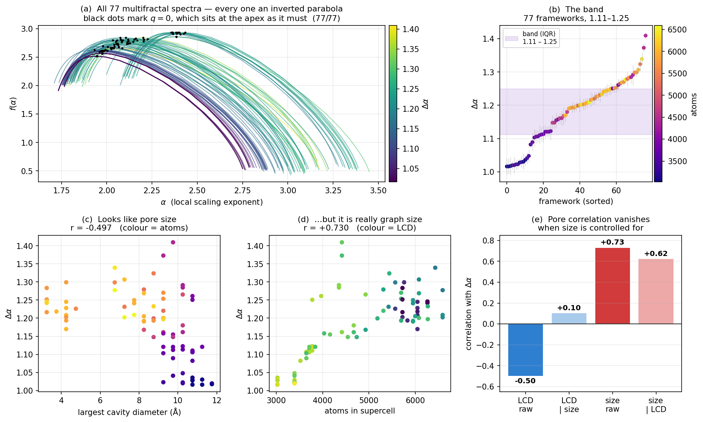

# Chapter 8 — Results

*Every number here was computed by our pipeline. Each comes with its caveat.*

---

## 8.1 · Result 1 — the graph construction is correct

Before any analysis can be trusted, the graph has to be right. Coordination numbers are
published, so this is a hard test with a known answer.

| Structure | Our node c.n. | Our linker c.n. | Published | Net | Verdict |
|---|---|---|---|---|---|
| HKUST-1 | 4 | 3 | (4, 3) | `tbo` | ✓ |
| MOF-5 | 6 | 2 | (6, 2) | `pcu` | ✓ |
| ZIF-8 | 4 | 2 | (4, 2) | `sod` | ✓ |
| **UiO-66** | **12** | 2 | (12, 2) | `fcu` | ✓ |

**All four match.** This is the anchor for everything that follows — any spectrum computed on
a graph that fails this table would be describing a material that does not exist.

And the contrast that shows it is not trivial:

| Structure | Naive graph | Correct graph | Published |
|---|---|---|---|
| HKUST-1 | 1 | 4 | 4 |
| MOF-5 | 4 | 6 | 6 |
| ZIF-8 | 2 | 4 | 4 |
| **UiO-66** | **1** | **12** | **12** |

> Discard the lattice translations and UiO-66's twelve connections collapse to **one**.

---

## 8.2 · Result 2 — influence cannot be ranked in a perfect crystal

**Every one of the four structures has exactly two distinct degree values** — one for nodes,
one for linkers.

This is not a computational failure. Every metal cluster in a perfect crystal is
symmetry-equivalent to every other, so they are genuinely identical and cannot be
distinguished.

> **A "top-k most influential" list is sorting a tie.** Its contents depend on the order the
> blocks happened to be indexed in.

This answers the original brief with a *no*, and the *no* is the finding. It also explains why
an influence ranking computed on a defect-free framework is unstable between implementations.

---

## 8.3 · Result 3 — defects make influence measurable

Remove one linker and the symmetry breaks:

| Graph | λ₂ perfect | λ₂ defective | Drop | Distinct centralities |
|---|---|---|---|---|
| **Unit cell** (14 blocks) | 1.438 | 1.186 | **−18%** | **2 → 4** |
| 2×2×2 supercell (112 blocks) | 0.628 | 0.551 | −12% | 2 → 15 |

Two things happen:

1. **The blocks become distinguishable** — "most influential" becomes answerable.
2. **λ₂ falls 18%** — the framework is measurably easier to cut in two. That number *is* the
   weakening, quantified, from removing a single strut.

And this is real chemistry, not a manipulation: missing-linker defects are common and
deliberately engineered in UiO-66 [15].

---

## 8.4 · Result 4 — the spectra are now computed correctly

After fixing the τ definition (Chapter 9):

| | Before the fix | After |
|---|---|---|
| τ(0) | 0.0000 | **−2.5669** |
| f(α₀) | 0.0000 | **+2.5669** |
| Spectra peaking at q = 0 | **0 / 77** | **77 / 77** |

**All 77 frameworks now produce proper inverted parabolas** with the apex at q = 0, which is
what a multifractal spectrum must look like.

*Panel (a): all 77 spectra, black dots marking q = 0 — every one at the apex.*

---

## 8.5 · Result 5 — the band exists

Across the 77 frameworks:

| Quantity | Value |
|---|---|
| Δα range | 1.016 – 1.410 |
| **Interquartile band** | **1.112 – 1.250** |
| Median Δα | 1.197 |
| Asymmetry A | −1.51 to −1.04 — **negative in all 77** |

A tight, well-defined band with a consistent asymmetry sign. As a descriptive fact about this
set of frameworks, that is solid.

---

## 8.6 · Result 6 — but the band does not yet mean what we hoped

This is the most important result in the project, and it is a negative one.

The obvious interpretation of Δα is *pore-network heterogeneity*, so it should correlate with
pore size. It appears to:

| Test | r |
|---|---|
| Δα vs pore diameter (LCD), raw | **−0.497** |

That looks like a real structural result. **It is not.** Control for graph size and it
evaporates:

| Test | r |
|---|---|
| Δα vs LCD, raw | −0.497 |
| **Δα vs LCD, controlling for graph size** | **+0.101** ← vanishes |
| Δα vs graph size, raw | +0.730 |
| **Δα vs graph size, controlling for LCD** | **+0.621** ← survives |

And in a linear model:

| Model | R² |
|---|---|
| graph size alone | 0.533 |
| pore diameter alone | 0.247 |
| both together | 0.538 |
| **what pore diameter adds over size alone** | **+0.005** |

> **Δα is mostly tracking how many atoms are in the supercell.**

And supercell size is set by `MIN_CELL_LENGTH` and the `MAX_ATOMS` cap — **parameters in our
own configuration file, not properties of the material.**

Panels (c), (d) and (e) of the figure above show this three ways: what looks like a pore-size
trend is a size trend wearing a disguise.

### Why this is the honest conclusion

This is the known **finite-size dependence** of the method — Δα grows with the graph, because
the fit window spans `ln(1/diameter)` to `ln(0.34)` and a bigger graph samples a wider range
of scales. With 77 structures of varying size we could finally *measure* it.

> A band built on an uncontrolled size effect would not survive the first person who checked
> it. Identifying the confound, quantifying it, and stating exactly what would remove it is a
> more defensible position than quoting the raw −0.497.

---

## 8.7 · Everything in one table

| # | Finding | Evidence | Confidence |
|---|---|---|---|
| 1 | The block network must be built periodically | UiO-66: 1 (naive) vs 12 (correct) vs 12 (published) | **High** — matches published crystallography on all four |
| 2 | Influence cannot be ranked in a perfect crystal | Only 2 distinct degree values in every structure | **High** — a symmetry argument, not a measurement artefact |
| 3 | Defects make influence measurable | λ₂ 1.438 → 1.186; centralities 2 → 4 | **High** — reproduced at two graph sizes |
| 4 | The spectra are computed to the paper's definition | 77/77 peak at q = 0; τ(0) = −2.5669 | **High** — Python and JS agree |
| 5 | 77 frameworks share a tight Δα band | IQR 1.112–1.250, A negative in all 77 | **High** as description |
| 6 | **That band is confounded by graph size** | Pore r: −0.497 → +0.101 controlling for size; size survives at +0.621; pore adds R² +0.005 | **High** — and it is why finding 5 cannot yet be interpreted |

---

## 8.8 · What we cannot claim

Say these out loud before anyone asks:

- **We cannot claim the band has chemical meaning.** It is currently a descriptive range whose
  main driver is a computational parameter.
- **We cannot claim anything about different metals.** All 77 structures have Zn₄O nodes — the
  set is effectively single-metal. The original zirconium question is untouched.
- **We cannot call the structures experimental.** All 77 are hMOF entries [8] — computer-
  generated candidates, never synthesised. We requested the experimental database [9]; the
  server returned these, and nothing was checking. A check now catches it.
- **Δα is not a gas-uptake predictor.** Nothing here computes adsorption. The graph is
  unweighted — it does not even know which element an atom is.

---

**Next:** [Chapter 9 — Mistakes We Found](09_mistakes.md), which covers three real bugs and how
each was caught.
