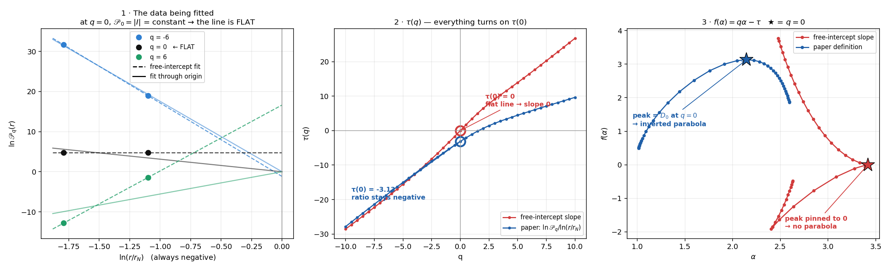

# Chapter 9 — Mistakes We Found

*Three real bugs. How each was caught, and what it teaches.*

This chapter exists because these are the most interesting part of the project, and because
**being able to explain a bug you found in your own work is stronger than presenting work with
no bugs in it.** Nobody believes the second one.

---

## 9.1 · Bug 1 — the spectrum was computed on a graph with no edges

### The symptom

The multifractal analysis returned nothing usable for half the test structures. Not an error —
just `NaN`.

### The cause

The code computed the spectrum on the **induced subgraph of the influential nodes**: take the
high-degree blocks, keep only the edges *between them*, and run the analysis on that.

In a MOF, the high-degree blocks are the **metal clusters**. And metal clusters are **never
bonded to each other** — they connect *through* linkers.

So that subgraph has **no edges at all**:

```
Edges inside the influential-node induced subgraph:

  HKUST-1        0 edges     ← the spectrum was being computed on THIS
  MOF-5          4 edges
  ZIF-8          0 edges     ← and THIS
  UiO-66         4 edges
```

No edges → no distances → no mass function → no spectrum.

### The fix

Compute the growth curves on the **full** block graph, and use the influential set only to
select *which* curves enter the analysis. The influential blocks are still the subject; they
are simply measured in the network they actually live in.

### The lesson

> **A chemically-informed sanity check caught a purely computational bug.** Knowing that metal
> clusters do not bond to each other is what made the zero-edge result obviously wrong rather
> than merely surprising.

---

## 9.2 · Bug 2 — averaging in the wrong order

### The symptom

Box covering is random, so it is repeated many times and averaged. The results were noisy and
the spectrum came out implausibly narrow.

### The cause

The code averaged the probability measures `p_i(r)` across trials **first**, and only then
raised them to the power `q`:

```python
# WRONG
p_avg = mean over trials of p_i(r)        # average first
Z = sum(p_avg ** q)                       # then exponentiate
```

Exponentiation is non-linear, so this is not the same as:

```python
# CORRECT
for each trial:
    Z_trial = sum(p_i(r) ** q)            # exponentiate per trial
lnZ = mean over trials of ln(Z_trial)     # then average, in log space
```

Averaging first **smooths away exactly the fluctuation that multifractality exists to
measure.**

### Measured, same graph, same seeds

| Estimator | Δα on HKUST-1 | Seed-to-seed scatter |
|---|---|---|
| Average `p(r)` first, then raise to `q` | 0.021 ± 0.004 | 17% |
| **Raise to `q` per trial, average `ln Z`** | **0.327 ± 0.032** | 10% |

A factor of **15** in the answer.

### How it was found

A teammate hit the same bug independently, on a different dataset and a different graph
construction, and reported it. Two people finding the same error on two datasets is decent
evidence it is a real methodological trap rather than a typo.

### The lesson

> **When you average over random trials, the order of averaging and any non-linear operation
> matters.** If a quantity is defined as `f(mean(x))`, check whether it should be
> `mean(f(x))`.

---

## 9.3 · Bug 3 — the one that deleted the peak of every spectrum

**This is the important one.** It was caught by a question from a team member: *"why isn't it
an inverted parabola?"*

### The symptom

Every spectrum sloped downhill instead of arching. From Chapter 6, we know that is not
allowed: a multifractal spectrum **must** peak at `q = 0`.

### The cause — one line

The paper defines the mass exponent as a **ratio**:

$$\tau(q) = \frac{\ln \mathcal{P}_q(r)}{\ln (r/r_N)}$$

Fitted over several radii, that is a straight line **through the origin** — the relation
`𝒫_q ~ (r/r_N)^τ` has no prefactor, so there is no intercept term.

Our code did:

```python
slope, intercept = np.polyfit(x, y, 1)
tau.append(slope)
```

which fits `y = mx + c` — a **free intercept**.

For most values of `q` the two barely differ, which is why nothing looked broken. At `q = 0`
they differ catastrophically:

- At `q = 0`, every term is `p_i⁰ = 1`, so `𝒫₀ = Σ 1 = |I|` — just the **count** of influential
  nodes.
- The radius has dropped out entirely, so **`ln 𝒫₀` is identical at every radius**. The data is
  a flat line.
- A free-intercept fit through a flat line has **slope 0**, so `τ(0) = 0`.
- Therefore `f(α₀) = 0·α − 0 = **0**`.

But `f(α₀)` is supposed to *be* the peak — it equals `D₀`, the fractal dimension. **Pinning it
to zero flattens the apex into the ground**, and what is left is a monotonically falling curve.

With the paper's ratio, `ln(r/r_N) < 0` (because `r < r_N`), so `τ(0) = ln|I| / negative` is
**negative**, and `f(α₀) = −τ(0) > 0` — the peak comes back.



*Left: the raw data being fitted. At q = 0 (black) the points are flat. Middle: the two fits
give completely different τ(0). Right: the consequence — the red curve has no peak.*

### The fix — one branch

```python
if tau_mode == "paper":                          # now the default
    t = float(np.sum(x * y) / np.sum(x * x))     # least squares THROUGH THE ORIGIN
else:
    t, intercept = np.polyfit(x, y, 1)           # the old behaviour, kept for comparison
```

Both modes are kept so the correction can be *demonstrated* rather than asserted.

### The effect

| | Before | After |
|---|---|---|
| τ(0) | 0.0000 | −2.5669 |
| f(α₀) | 0.0000 | +2.5669 |
| **Spectra peaking at q = 0** | **0 / 77** | **77 / 77** |

Everything downstream of τ changed with it: α₀, the asymmetry A and D(q) became meaningful
quantities for the first time, and the Δα values roughly quadrupled.

### The lesson

> **When a method has a known structural property, use it as a test.** "The spectrum must be
> an inverted parabola" is free, takes one line to check, and caught a bug that had silently
> invalidated every number we had produced.
>
> Also: **read the paper's definition literally.** `ln P / ln r` is a *ratio*. It is not "fit a
> line and take the slope", and the difference only bites in one place — which is exactly the
> place that matters most.

---

## 9.4 · A near-miss worth mentioning: the dataset

Not a code bug, but the same class of problem — an unchecked assumption.

The notebook requested the **CoRE MOF 2019** database (experimental structures) and printed
*"real CoRE MOF 2019 structures"*. But every structure returned was named `hMOF-###` — the
**hypothetical MOF** database [8]: computer-generated candidates that have never been made.

`database=` is a **request**, not a guarantee, and nothing was verifying the response.

Two consequences:

- Nothing from this set may be described as "experimental" or "real".
- **All 77 have Zn₄O nodes** — the set is effectively single-metal, so no cross-metal claim is
  possible.

The fix was a check that counts the databases actually returned and warns loudly on a mismatch,
plus a metal-composition report.

> **The lesson:** verify what you received, not what you asked for.

---

## 9.5 · The pattern

All four have the same shape:

| Bug | What was assumed | What was true |
|---|---|---|
| Edgeless subgraph | The influential nodes form a connected network | Metal clusters never bond to each other |
| Averaging order | `mean` then `power` = `power` then `mean` | Exponentiation is non-linear |
| τ definition | "fit a line, take the slope" | The paper defines a **ratio** — no intercept |
| Dataset | The server returns what you asked for | It returned a different database entirely |

In every case the code ran without error and produced plausible-looking numbers. **None of
these would have been caught by testing that the code does not crash.**

What caught them:

1. **A chemical sanity check** (metal clusters do not bond to each other)
2. **An independent implementation** disagreeing
3. **A structural property of the method** used as a test (the parabola)
4. **Checking the response instead of the request**

> If you are asked in the review *"how do you know your results are right?"* — this chapter is
> the answer. Not "we tested it", but "here are four specific things we assumed, that turned
> out to be false, and here is how each was caught."

---

**Next:** [Chapter 10 — Limits and Next Steps](10_limitations.md).
